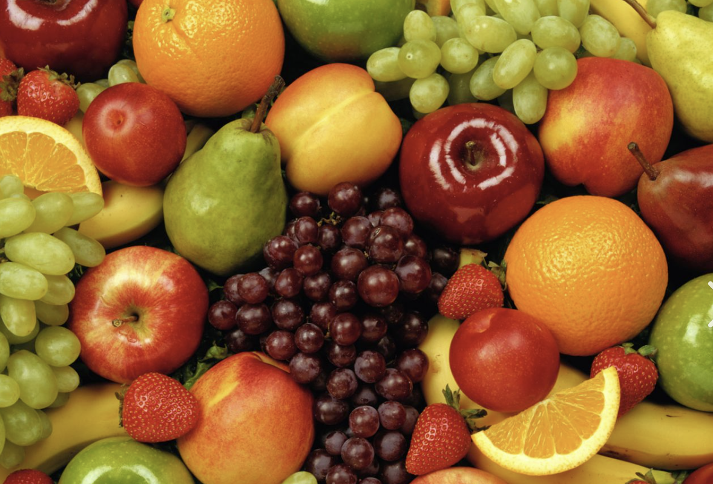
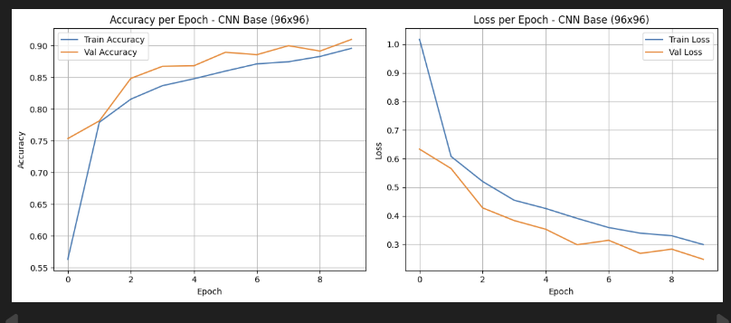
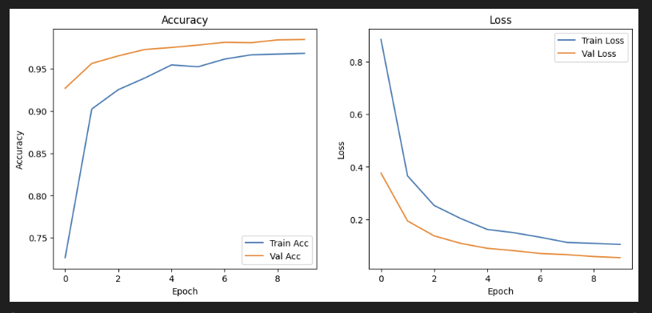
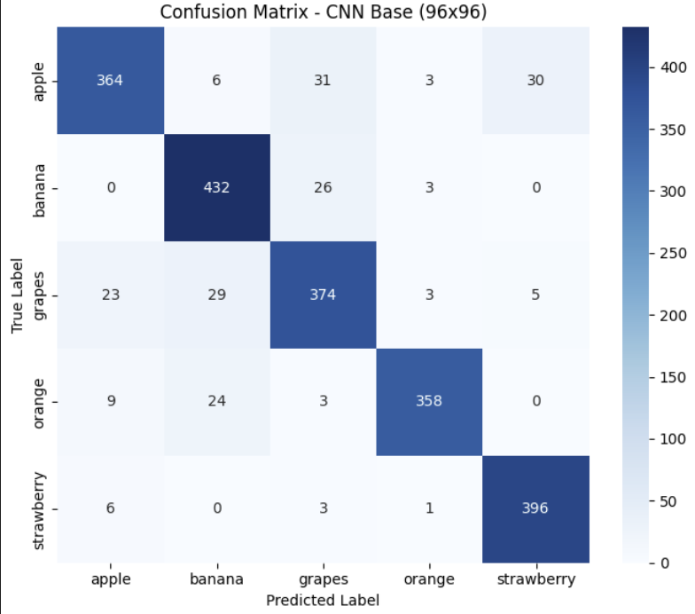
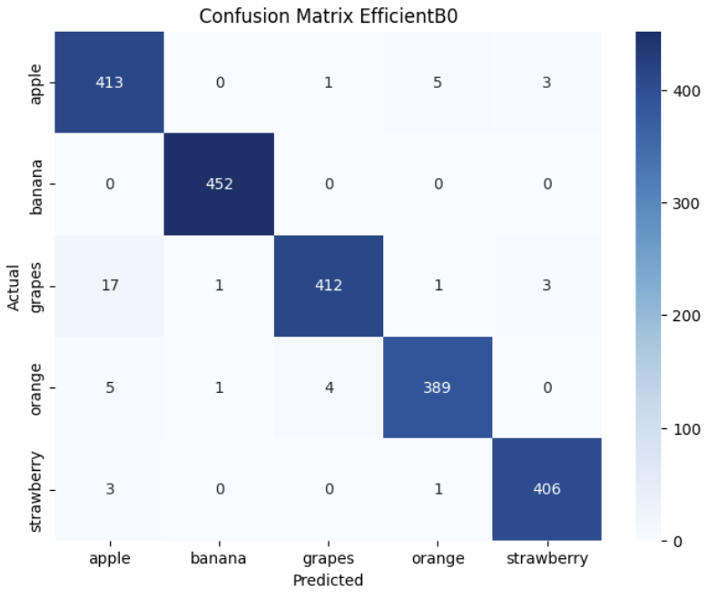
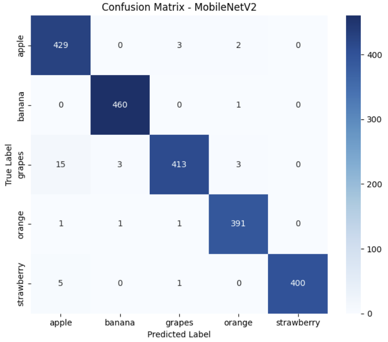
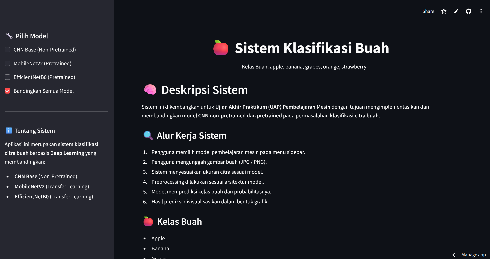
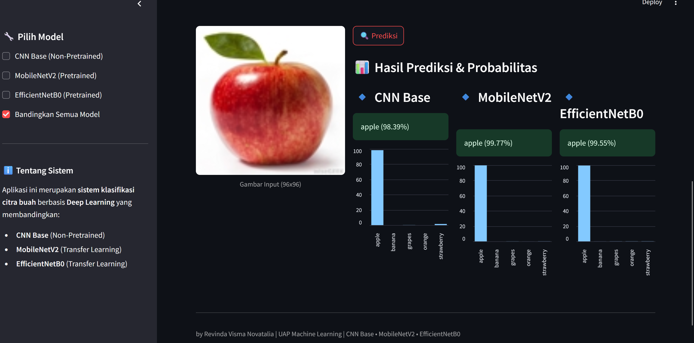

# FRUIT IMAGE CLASSIFICATION 🍎🍌🍇

<p align="center">
  
</p>

---

## 📌 DESKRIPSI PROYEK

Proyek ini bertujuan untuk membangun **sistem klasifikasi gambar buah** menggunakan metode *Deep Learning*.  
Tiga model digunakan untuk membandingkan performa klasifikasi, yaitu:

1. **CNN Base (Non-Pretrained)**  
2. **Pretrained Model 1 (EfficientNetB0)**  
3. **Pretrained Model 2 (MobileNetV2)**  

Model terbaik kemudian diimplementasikan ke dalam **aplikasi web interaktif berbasis Streamlit**.

---

## 🎯 TUJUAN PROYEK

- Mengklasifikasikan gambar buah secara otomatis
- Membandingkan performa model non-pretrained dan pretrained
- Mengevaluasi model menggunakan metrik klasifikasi
- Membangun dashboard interaktif menggunakan Streamlit

---

## 📊 DATASET DAN PREPROCESSING

### DATASET

Dataset terdiri dari gambar buah dengan lima kelas:
- Apple  
- Banana  
- Grapes  
- Orange  
- Strawberry  

### PREPROCESSING

Tahapan preprocessing yang dilakukan:
- Resize gambar  
  - 96 × 96 piksel untuk CNN Base  
  - 224 × 224 piksel untuk model pretrained  
- Normalisasi nilai piksel ke rentang 0–1  
- Data augmentation:
  - Rotasi
  - Flip horizontal
  - Zoom
  - Penyesuaian kecerahan

---

## 🧠 MODEL YANG DIGUNAKAN

### 1️. CNN BASE (NON-PRETRAINED)

- Dibangun dari awal (*from scratch*)
- Arsitektur: Convolution → ReLU → MaxPooling → Flatten → Dense
- Input gambar: 96 × 96 piksel

**Kelebihan:**
- Ringan dan cepat dilatih
- Cocok untuk dataset kecil

**Kekurangan:**
- Akurasi terbatas
- Sensitif terhadap variasi gambar

---

### 2️. PRETRAINED MODEL: EFFICIENTNETB0

- Model pretrained pada ImageNet
- Menggunakan transfer learning dan fine-tuning
- Input gambar: 224 × 224 piksel

**Kelebihan:**
- Arsitektur efisien
- Potensi akurasi tinggi

**Kekurangan:**
- Performa tidak optimal pada eksperimen ini
- Perlu penyesuaian preprocessing dan training

---

### 3. PRETRAINED MODEL: MOBILENETV2

- Model pretrained ringan dan cepat
- Fine-tuning dilakukan pada layer akhir
- Input gambar: 224 × 224 piksel

**Kelebihan:**
- Akurasi sangat tinggi
- Cocok untuk aplikasi web real-time

**Kekurangan:**
- Kapasitas fitur terbatas dibanding model besar

---

## 📈 HASIL EVALUASI MODEL

Evaluasi performa dilakukan menggunakan data uji (test set) untuk mengukur kemampuan generalisasi masing-masing model dalam mengklasifikasikan gambar buah ke dalam lima kelas, yaitu Apple, Banana, Grapes, Orange, dan Strawberry. Metrik utama yang digunakan pada evaluasi ini adalah accuracy, yaitu perbandingan antara jumlah prediksi yang benar terhadap total data uji

| Model | Accuracy | Analisis |
|------|----------|----------|
| CNN Base | 0.90 | Model CNN yang dibuat dari awal sudah bisa mengklasifikasikan gambar buah dengan cukup baik. Namun karena arsitekturnya masih sederhana, model ini kurang maksimal dalam mengenali perbedaan detail gambar seperti bentuk, tekstur, dan kondisi pencahayaan yang beragam. |
| EfficientNetB0 | 0.21 | Model ini memiliki performa yang rendah karena belum dapat menyesuaikan diri dengan dataset buah yang digunakan. Hal ini kemungkinan terjadi karena proses fine-tuning belum optimal, perbedaan karakteristik dataset ImageNet dengan dataset buah, serta jumlah data latih yang terbatas. |
| MobileNetV2 | **0.98** | Model ini memberikan hasil terbaik dengan akurasi paling tinggi. Arsitekturnya yang ringan dan efisien membantu model mengekstraksi fitur penting dengan baik, sehingga hasil prediksi lebih stabil dan cocok digunakan pada aplikasi web secara real-time.|

**Kesimpulan:**  
Berdasarkan hasil evaluasi, MobileNetV2 menjadi model dengan performa terbaik karena memiliki akurasi paling tinggi dan hasil prediksi yang paling stabil. Model CNN Base sudah cukup baik untuk klasifikasi dasar, tetapi masih memiliki keterbatasan dalam mengenali detail gambar yang beragam. Sementara itu, EfficientNetB0 menunjukkan performa paling rendah karena belum mampu menyesuaikan diri dengan dataset yang digunakan. Oleh karena itu, MobileNetV2 dipilih sebagai model utama untuk digunakan pada aplikasi web klasifikasi gambar buah.

---

## 🖼️ VISUALISASI TRAINING

### Loss & Accuracy

<p align="center">
  
  
  
</p>

### Confusion Matrix

<p align="center">
  
  
  
</p>

---

## 🚀 MENJALANKAN APLIKASI (STREAMLIT)

### 1. Clone Repository

```bash
git clone https://github.com/username/fruit-image-classification.git
cd fruit-image-classification
```

### 2. Buat Virtual Environment

```bash
python -m venv .venv
```

### 3. Aktivasi Environment

```bash
# Windows
.venv\Scripts\activate

# macOS/Linux
source .venv/bin/activate
```

### 4. Install Dependencies

```bash
pip install -r requirements.txt
```

### 5. Jalankan Aplikasi

```bash
streamlit run app.py
```

---

## 🌐 LIVE DEMO

[LINK-DASHBOARD_FRUIT_IMAGE_CLASSIFICATION](https://fruit-image-classification-raq749yzbxxknmpnc9gwfl.streamlit.app/)

---

## 🖥️ TAMPILAN DASHBOARD STREAMLIT


Aplikasi dashboarddibangun menggunakan Streamlit untuk melakukan klasifikasi gambar buah secara interaktif dengan opsi pemilihan model.

### FITUR UTAMA DASHBOARD:

### 1. Upload Gambar
Pengguna dapat mengunggah gambar buah dengan format JPG atau PNG.

### 2. Pemilihan Model Klasifikasi
Dashboard menyediakan beberapa pilihan model:
- CNN Base (Non-Pretrained)
- EfficientNetB0 (Pretrained)
- MobileNetV2 (Pretrained)
- Semua Model (perbandingan hasil prediksi)

### 3. Hasil Prediksi
Sistem menampilkan:
- Nama kelas buah hasil prediksi
- Nilai probabilitas (confidence score) dalam bentuk persentase (%)
- Informasi model yang digunakan

### 4. Visualisasi Distribusi Probabilitas Kelas
Grafik distribusi probabilitas tiap kelas buah untuk membantu interpretasi hasil prediksi.

### 5. Prediksi Real-Time
Prediksi dilakukan secara real-time menggunakan model yang telah dilatih.


<p align="center">
  
  
  
</p>

---

## 👤 AUTHOR

**NAMA:** 
Revinda Visma Novatalia

**NIM :** 
202210370311176

**PRODI:** 
Teknik Informatika - Universitas Muhammadiyah Malang

**DATASET:** 
[LINK-DATASET](https://www.kaggle.com/datasets/ismail703/fruits)

---
