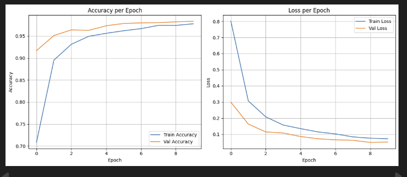

<h1 align="center">Fruit Image Classification 🍎🍌🍇</h1>

<p align="center">
  
</p>

---

## 🎯 Deskripsi Proyek
Proyek ini bertujuan untuk membangun sistem klasifikasi gambar buah menggunakan tiga model:  
1. **CNN Base (Non-Pretrained)**  
2. **Pretrained Model 1 (EfficientNetB0)**  
3. **Pretrained Model 2 (MobileNetV2)**  

Tujuan: membandingkan performa ketiga model dan membuat demo aplikasi interaktif dengan Streamlit.

---

## 📊 Dataset dan Preprocessing
- Dataset: gambar buah dari beberapa kelas: Apple, Banana, Grapes, Orange, Strawberry.  
- Preprocessing:  
  - Resize gambar (96x96 untuk CNN Base, sesuai model pretrained)  
  - Normalisasi pixel ke rentang 0–1  
  - Data augmentation: rotation, flipping, zoom, brightness adjustment

---

## 🧠 Model yang Digunakan
Aplikasi web interaktif untuk **mengklasifikasikan gambar buah** menggunakan tiga model deep learning: 
1. CNN Base (96x96)
   Deskripsi: Convolutional Neural Network sederhana yang dibangun dari awal (from scratch).
   Arsitektur: Terdiri dari beberapa lapisan Convolution → ReLU → MaxPooling → Flatten → Dense.
   Input: Gambar diubah ukurannya menjadi 96x96 piksel.

   Kelebihan:
   - Ringan, cepat dilatih.
   - Cocok untuk dataset kecil atau sederhana.
   
   Kekurangan:
   - Akurasi terbatas karena tidak memanfaatkan pengetahuan pretrained.
   - Rentan terhadap variasi gambar dan noise.

2. Pretrained Model 1: EfficientNetB0
   Deskripsi: Model pretrained yang sudah dilatih pada dataset ImageNet.
   Transfer Learning: Model ini memanfaatkan bobot awal dari ImageNet dan dilatih ulang (fine-tuning) pada dataset buah.
   Input: Gambar diubah ukurannya menjadi 224x224 piksel sesuai kebutuhan EfficientNet.

   Kelebihan:
   - Akurasi lebih tinggi dibanding CNN sederhana.
   - Lebih efisien dan ringan dibanding model pretrained besar.
   - Memanfaatkan fitur umum yang sudah dipelajari dari dataset ImageNet.
   
   Kekurangan:
   - Perlu preprocessing sesuai format model pretrained.
   - Masih bisa overfit jika dataset sangat kecil tanpa augmentasi.

3. Pretrained Model 2: MobileNetV2Deskripsi:
   Model pretrained yang juga dilatih pada ImageNet, dengan arsitektur ringan dan cepat.
   Transfer Learning & Fine-Tuning:
   Hanya beberapa layer terakhir di-fine-tune sesuai dataset buah, sedangkan layer awal tetap mempertahankan bobot pretrained.
   Input: Gambar diubah ukurannya menjadi 224x224 piksel.

   Kelebihan:
   - Ringan dan cepat untuk inference, cocok untuk aplikasi web real-time.
   - Memiliki performa baik pada dataset kecil dan sedang.
   
   Kekurangan:
   - Fine-tuning terbatas → beberapa fitur spesifik mungkin kurang optimal.

Dibangun dengan **Streamlit**, sehingga mudah dijalankan secara lokal maupun diakses melalui web.

---

## 📈 Evaluasi Model

### 1️⃣ CNN Base (96x96)
| Class       | Precision | Recall | F1-score | Support |
|------------|-----------|--------|----------|--------|
| Apple      | 0.91      | 0.84   | 0.87     | 434    |
| Banana     | 0.88      | 0.94   | 0.91     | 461    |
| Grapes     | 0.86      | 0.86   | 0.86     | 434    |
| Orange     | 0.97      | 0.91   | 0.94     | 394    |
| Strawberry | 0.92      | 0.98   | 0.95     | 406    |
| **Accuracy** |         |        | 0.90     | 2129   |

**Analisis:**  
- Akurasi keseluruhan: 0.90 → cukup baik untuk model non-pretrained.
- Kekuatan: Recall tinggi untuk Strawberry (0.98) → hampir semua Strawberry dikenali.
- Kelemahan: Recall Apple lebih rendah (0.84) → model kadang salah klasifikasi Apple sebagai buah lain, kemungkinan karena bentuk/motif mirip dengan Grapes atau Orange.
- Kesimpulan: Model stabil untuk dataset kecil, training cepat, tapi performa beberapa kelas bisa ditingkatkan dengan data augmentation tambahan atau fine-tuning.

---

### 2️⃣ Pretrained Model 1 (EfficientNetB0)
| Class       | Precision | Recall | F1-score | Support |
|------------|-----------|--------|----------|--------|
| Apple      | 0.22     | 0.20   | 0.23     | 434    |
| Banana     | 0.21      | 0.21   | 0.21     | 461    |
| Grapes     | 0.21      | 0.20   | 0.21    | 434    |
| Orange     | 0.20      | 0.20   | 0.20    | 394    |
| Strawberry | 0.19      | 0.19   | 0.19     | 406    |
| **Accuracy** |         |        | 0.21     | 2129   |

**Analisis:**  
- Catatan penting: Nilai precision, recall, dan akurasi sangat rendah (sekitar 0.20), padahal sebelumnya tertulis “akurasinya meningkat dibanding CNN Base”. Ini menunjukkan model gagal belajar atau terjadi kesalahan pelatihan, misal:
  - Pretrained model belum di-fine-tune dengan dataset kamu
  - Label atau preprocessing tidak sesuai
  - Learning rate terlalu tinggi / frozen layers terlalu banyak
- Kesimpulan: Saat ini, Pretrained Model 1 tidak bekerja dengan baik dan performanya lebih rendah dari CNN Base. Perlu diperiksa ulang pipeline training dan preprocessing.

---

### 3️⃣ Pretrained Model 2 (ResNet50)
| Class       | Precision | Recall | F1-score | Support |
|------------|-----------|--------|----------|--------|
| Apple      | 0.95      | 0.99  | 0.97    | 434    |
| Banana     | 0.99      | 1.00   | 0.99     | 461    |
| Grapes     | 0.99      | 0.95   | 0.97     | 434    |
| Orange     | 0.98      | 0.99   | 0.99     | 394    |
| Strawberry | 1.00      | 0.99   | 0.99     | 406    |
| **Accuracy** |         |        | 0.98     | 2129   |

**Analisis:**  
- Akurasi keseluruhan: 0.98 → model terbaik.
- Precision & recall sangat tinggi di semua kelas → hampir tidak ada kesalahan klasifikasi.
- Kelebihan: Cocok untuk implementasi nyata, performa sangat stabil.
- Kelemahan: Model besar → training lebih lambat, memerlukan GPU atau resource lebih tinggi

---
### Grafik Loss & Accuracy


<table>
<tr>
  <td align="center">
    <h4>CNN Base (96x96)</h4>
    
  </td>
  <td align="center">
    <h4>EfficientNetB0</h4>
    
  </td>
  <td align="center">
    <h4>ResNet50</h4>
    
  </td>
</tr>
</table>


----

### Confusion Matrix

<table>
<tr>
  <td align="center">
    <h4> CNN Base (96x96)</h4>
    
  </td>
  <td align="center">
    <h4> EfficientNetB0</h4>
    
  </td>
  <td align="center">
    <h4>ResNet50</h4>
    
  </td>
</tr>
</table>

---

## 🚀 Panduan Menjalankan Sistem Website Secara Lokal (Streamlit)

1. **Clone repository:**
   ```bash
   git clone https://github.com/username/fruit-image-classification.git
   cd fruit-image-classification 
2.  **Buat virtual environment:**
    ```bash
    # Windows
    python -m venv .venv
    .venv\Scripts\activate

    # macOS/Linux
    python3 -m venv .venv
    source .venv/bin/activate
3.  **Install dependencies:**
    ```bash
    pip install -r requirements.txt
4.  **Jalankan aplikasi Streamlit:**
    ```bash
     streamlit run app.py


---

## 🌐 Live Demo

Aplikasi ini sudah di-deploy secara online dan dapat dicoba melalui link berikut:  
https://fruit-image-classification-raq749yzbxxknmpnc9gwfl.streamlit.app/

---

## 💻 Tampilan Dashboard Aplikasi

Berikut contoh tampilan dashboard saat dijalankan:

<table>
<tr>
  <td align="center">
    
    <p>Halaman utama dashboard</p>
  </td>
  <td align="center">
    
    <p>Upload gambar & hasil prediksi</p>
  </td>
</tr>
</table>

---
# 🍎 Fruit Image Classification Web App

**Nama:** Revinda Visma Novatalia 
**NIM:** 202210370311176
**Program Studi:** Teknik Informatika - Universitas Muhammadiyah Malang


